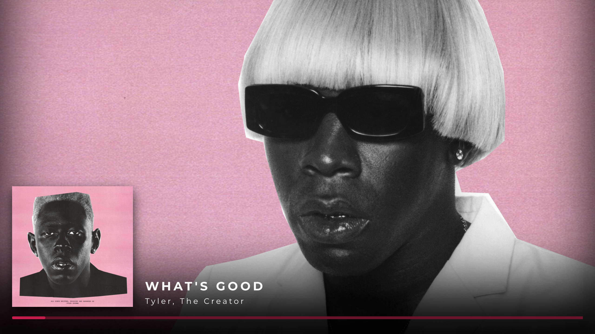
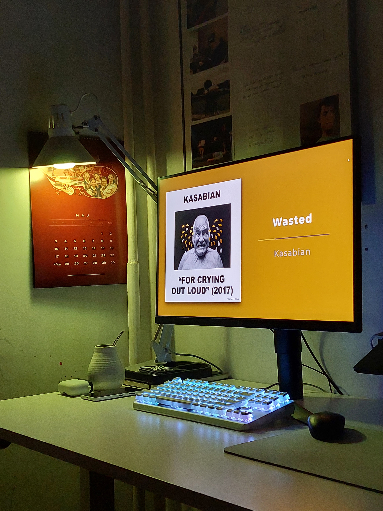

# 🔥 Clean Spotify Player

A simple app that displays pleasing visuals for your currently playing music on Spotify.
## Try it!
App is available here: [https://clean-spotify.club](https://clean-spotify.club).

## What's new?
Apart from being rewritten from scrach with different tech stack, the player has a new display mode inspired by the one recently introduced by the official Spotify desktop app. Also I changed hosting method of the project, so that there are no 10s cold starts of the backend (I even threw out fancy loader because there's no need for it anymore 😅). 

## Tech stack
- NextJS
- Typescript
- Xstate for state management (my first time using it)
- useSWR for data fetching
- styled-components, styled-system and atomic-layout for the layout
- node-vibrant for sampling color palettes
## Examples

